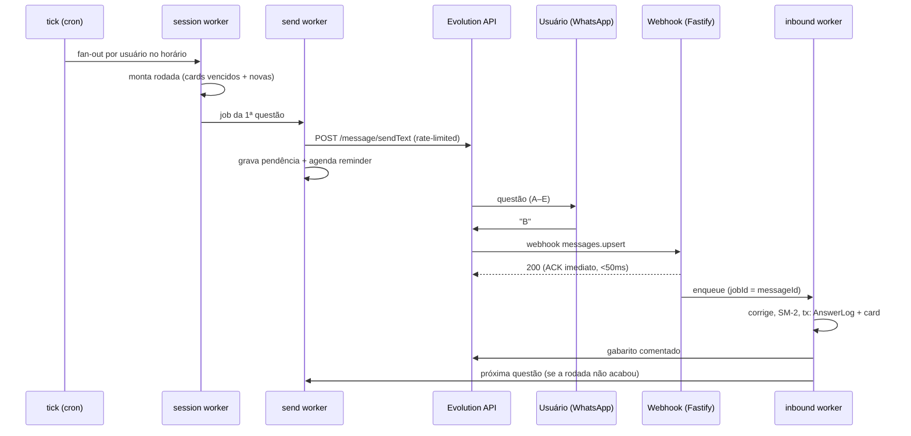

# Hermes Agent — Arquitetura de Filas e Webhooks

> Motor de repetição espaçada ativa via WhatsApp (Evolution API + BullMQ + Redis).
> Decisões aqui assumem o schema de `prisma/schema.prisma` (SpacedRepetitionCard, AnswerLog).

## 1. Topologia de processos

```
auditor-ai/
├─ apps/
│  ├─ web/       → Next.js 15 (dashboard) — NÃO roda filas
│  └─ hermes/    → serviço Node standalone
│     ├─ server  → Fastify: webhooks da Evolution API (processo HTTP)
│     └─ workers → BullMQ workers (processo separado, sem HTTP)
└─ packages/
   └─ db/        → Prisma Client compartilhado
```

**Por que Fastify standalone e não Route Handler do Next?**
Workers BullMQ exigem processo *long-lived* com conexão Redis persistente —
incompatível com o lifecycle serverless/edge do Next. Colocar o webhook no
mesmo serviço dos workers (processos separados, mesmo deploy) mantém a
latência de ACK baixa e isola o dashboard de picos de tráfego do WhatsApp.
Escala independente: 1 réplica HTTP é suficiente; workers escalam horizontal
(BullMQ distribui jobs entre réplicas sem coordenação extra).

## 2. Filas

| Fila | Produtor | Worker faz | Config chave |
|---|---|---|---|
| `hermes.tick` | Repeatable job (cron `0 * * * *` UTC) | Seleciona usuários cuja hora local == `sendHour`; fan-out de 1 job `hermes.session` por usuário | `jobId` fixo do repeatable |
| `hermes.session` | `tick` | Monta a rodada diária: cards vencidos (`[userId, dueAt]`) + preenche cota com questões novas priorizadas por `peso × incidência × fraqueza`; enfileira o 1º `hermes.send` | `jobId: session:{userId}:{date}` (idempotente) |
| `hermes.send` | `session` e `inbound` | Chama Evolution API (envia questão), grava questão pendente, agenda `hermes.reminder` com delay | **limiter global** (ex: 2 msg/s) — anti-ban WhatsApp |
| `hermes.inbound` | **Webhook** (produtor síncrono) | Parseia resposta, corrige, roda SM-2, persiste em transação, envia gabarito comentado, enfileira próximo `send` da sessão | `jobId: msg id da Evolution` (dedup de webhook retry) |
| `hermes.reminder` | `send` (delayed job) | Se a questão segue sem resposta após N min: 1 lembrete; no 2º timeout marca card como *skipped* e reagenda +1 dia | delay configurável (default 60 min) |

**Padrão geral dos workers:** `attempts: 5`, backoff exponencial (base 3s),
`removeOnComplete: { age: 24h }`, failed jobs retidos (DLQ implícita do BullMQ)
com alerta quando `failedCount` cruza limiar. Bull Board montado no Fastify
(`/admin/queues`, atrás de auth) para inspeção.

## 3. Fluxo ponta a ponta



## 4. Decisões críticas

### 4.1 Invariante: 1 questão pendente por usuário
O texto "B" só é interpretável se soubermos *qual* questão está aberta. O fluxo
é **sequencial**: o usuário só recebe a próxima após responder (ou timeout).
A pendência vive em Redis — `hermes:pending:{userId}` →
`{ questionId, cardId, sentAt, sessionRemaining[] }`, TTL 6h — porque é estado
efêmero de alta rotatividade; o histórico durável fica no `AnswerLog`.
Mensagem recebida sem pendência ativa → resposta educada do Hermes ("nenhuma
questão em aberto") e descarte.

### 4.2 Webhook: ACK rápido, processamento assíncrono
A Evolution API faz retry em não-2xx. O handler **não toca no Postgres**:
valida o token, filtra eventos (`messages.upsert`, ignora `fromMe` e grupos),
enfileira e responde 200. Dedup por `jobId = message.key.id` — retry do
webhook vira no-op no BullMQ. Payload inválido também recebe 200 (logado),
para não gerar tempestade de retries.

### 4.3 SM-2: mapeamento de qualidade
Sem autoavaliação 0–5 do Anki, derivamos a nota:

| Resultado | `responseTimeMs` | quality |
|---|---|---|
| Correta | < 60s | 5 |
| Correta | 60s–5min | 4 |
| Correta | > 5min | 3 |
| Errada | — | 1 |
| Timeout (2×) | — | skip (card +1 dia, sem penalizar EF) |

Atualização de `easeFactor`/`intervalDays`/`repetitions` numa **transação
Prisma** junto com o insert do `AnswerLog` — nunca meia-atualização. Perto da
`Enrollment.targetDate`, intervalo é limitado (`cap = dias até a prova / 2`).

### 4.4 Timezone e agendamento
Um único cron horário em UTC; o worker `tick` compara `sendHour` na timezone
do usuário (Luxon). Evita N repeatable jobs por usuário (drift e órfãos ao
mudar preferência) — a preferência é lida na hora do tick, sempre fresca.

### 4.5 Segurança
- Webhook exige header `apikey` == `EVOLUTION_WEBHOOK_TOKEN` (Evolution suporta
  header custom); 401 caso contrário — única exceção ao "sempre 200".
- Correlação usuário ↔ mensagem por `remoteJid` normalizado para E.164 vs
  `User.phone`. JID desconhecido → descarta e loga.
- Bull Board e rotas admin atrás de basic auth no mínimo.

## 5. Backpressure e gargalos previstos

1. **Rate limit Evolution/WhatsApp** — resolvido no `hermes.send` com
   `limiter: { max: 2, duration: 1000 }` global à fila (não por worker).
2. **Fan-out do tick** — `session` é idempotente por `jobId` diário; se o tick
   rodar 2× (deploy no meio da hora), não há rodada duplicada.
3. **Hot key no Postgres** — a query de vencidos usa o índice
   `[userId, dueAt]`; o fan-out por usuário naturalmente particiona a carga.
4. **Redis down** — workers param (fail-safe); webhook responde 503 e a
   Evolution reenvia depois. Nenhuma resposta de usuário se perde.

## 6. Variáveis de ambiente (apps/hermes)

```
DATABASE_URL=postgresql://...
REDIS_URL=redis://...
EVOLUTION_API_URL=https://evo.example.com
EVOLUTION_API_KEY=...
EVOLUTION_INSTANCE=auditor
EVOLUTION_WEBHOOK_TOKEN=...   # valida chamadas recebidas
PORT=3333
```
